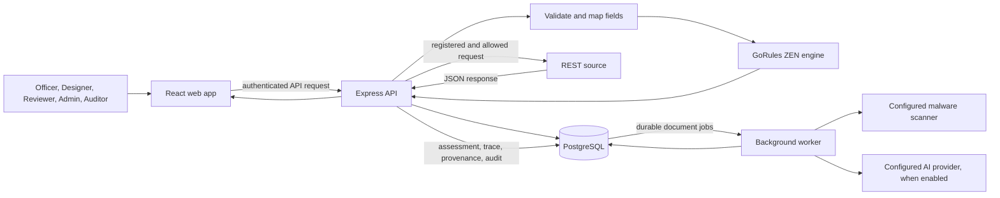

# Pension360 Project Guide

**A plain-language guide to what the project does, how its modules work, and how the code fits together.**

This guide describes the Node.js edition in this folder. It is based on the application source, the project's functional and developer documentation, and its local demo workflow. It is an explanation of the implementation, not a statement that every customer integration or production release gate has been completed.

## 1. The project in one minute

Pension360 is a pension operations and decision-support workspace. It brings member information, evidence documents, configured business rules, investigations, policy references, and review history together so staff can see what needs attention.

The application can fetch facts from registered REST APIs, convert those facts to the inputs expected by a rule, run a deterministic decision graph, save an assessment, and route findings for human review. It can also help staff process documents and ask evidence-grounded questions.

The existing pension or ERP platform remains the official system of record. Pension360 does **not** make a statutory entitlement decision, change the core pension record, authorize a payment, or claim a finding is fraud. Seeded people, procedures, policies, and sample results are fictional.

### Why it was created

Pension work often requires staff to bring together facts from a member or employer system, check documents, apply the organisation's procedures, and explain why a case needs attention. When those checks are spread across systems and manual steps, information can be difficult to compare and a review can be hard to reproduce later.

Pension360 provides one workspace for those supporting steps. It is intended to help pension teams gather approved source facts, apply business-configured checks consistently, preserve the evidence behind each result, and route uncertain or exceptional records to a person for review. It supports preparation and assurance; it does not replace the official pension/ERP system or the authority of a pension decision-maker.

### Main use cases

1. **Prepare a retirement file:** fetch current member, service, employer, and document facts; check that the configured evidence is present and consistent; show the officer whether the file is ready for human review, needs verification, or could not be evaluated.
2. **Review documents:** attach an original document to a member, extract or transcribe candidate fields, compare them with the original, and require an independent person to verify the evidence.
3. **Check service and contributions:** compare configured service periods or expected/received contribution values, then send discrepancies for investigation rather than changing payroll or pension records.
4. **Check payment information:** flag a configured unexplained difference between amounts, retain the calculation evidence, and let staff investigate it. A flagged difference is not proof of fraud or an instruction to recover money.
5. **Track investigation work:** open or reuse a case for a finding, assign an owner, set priority/due date, record notes/reasons, and retain the related assessment evidence and audit trail.
6. **Forecast retirement volume:** estimate how many roster members may reach their expected retirement dates over a selected horizon. This is a headcount planning aid, not a pension-liability forecast.
7. **Configure and govern checks:** let Designers map approved source fields and author visual rules; bind tests to the saved version; require a separate review before publication.
8. **Explain saved evidence:** let authorized staff inspect the context available to the assistant and, when an approved AI provider is configured, ask for a cited explanation in English or Arabic. The assistant does not make or approve the deterministic result.

### Example user journey

An Officer opens a member record and runs the published retirement-readiness assessment. The server fetches the member's latest permitted facts from the configured pension API, converts them to the rule's expected inputs, and runs the approved rule version. Pension360 saves the assessment evidence and shows the result. If the result identifies missing or conflicting information, the Officer investigates it in a linked case. If the facts are unavailable, the result explains that the rule could not be evaluated rather than treating the missing data as proof that the member is ineligible. A qualified human reviews the evidence and makes any official decision in the authoritative pension process.

## 2. The important ideas

| Term | Meaning in this project |
| --- | --- |
| Member | A person in the pension roster. The demo uses IDs such as `M001`. |
| Source connection | A server-configured connection to an approved REST API. It includes a base URL, allowed origin, operation path, request bindings, and optionally a server-side credential reference. |
| Source response | The JSON returned by the API for a member and assessment date. The source system owns these facts. |
| Field mapping | A saved association between a field in the source JSON and an input name the rule expects. A mapping can validate a value's type or transform a date into completed years. |
| Rule / decision model | A versioned business decision configured in the visual Studio and represented internally as a GoRules JDM graph. |
| JDM / ZEN | GoRules' visual decision-model format/editor (JDM) and server-side execution engine (ZEN). JDM is the visual editor the business user works with. |
| Assessment / evaluation | A recorded run of a rule against a member and assessment date. It contains inputs, output, issues, trace, source provenance, and rule version. |
| Simulation / preview | A non-live test of a draft or current mapping. The API-to-rule workbench preview shows data and output but does not create an assessment or case. |
| Case | A human investigation/review record linked to a member and, when appropriate, an assessment. A case status is not itself an eligibility decision. |
| Evidence | Source data, uploaded originals, extracted or transcribed fields, citations, assessment results, and review/audit history that explain what a person saw and did. |
| Independent review | A governance step performed by an eligible person other than the author/uploader/transcriber/submitter involved in the item. Administrator status does not bypass self-review controls. |

## 3. How the system fits together

The repository is an npm workspace containing a React web application and an Express API. PostgreSQL stores the application records and job queue. The API talks to the configured REST source and runs JDM rules; the browser does not decide the final rule result.



### API-to-rule example

For the demo readiness rule, the server requests a fictional sample such as:

```json
{
  "person": { "dateOfBirth": "1967-03-10" },
  "pension": { "joiningDate": "1991-06-01", "serviceVerified": true },
  "employer": { "joiningDate": "1991-06-01" },
  "documents": { "missingCount": 0 },
  "memberId": "M001"
}
```

The Designer maps `/person/dateOfBirth` to the decision input `ageYears`, with type `number` and transformation **Completed age in years**. The selected assessment date determines the calculation. Other configured mappings pass joining dates, service verification, and missing document count through to the rule.

The backend validates the source path and target name, checks required values and types, builds the target JSON, and executes the selected rule graph. The workbench then displays the original API response, converted rule input, and rule result. The demonstrated sample yields `ageYears: 59` and `READY_FOR_REVIEW` for M001 on the demo date. This preview does not save an assessment or open a case.

## 4. Business modules and their workflows

The original Pension360 layout has five major business groups, shared tools, and Rules & Data Studio. The current UI restores the logo, grouped navigation, screen names, and familiar page framing; some old Java-only screens are represented by supported shared workspaces rather than claiming exact old-backend parity.

### 4.1 Retirement Readiness & Forecasting

**Readiness assessment:** An Officer selects a member, assessment date, and published readiness rule. The server fetches fresh facts, applies the rule's stored mappings, and runs the published graph. The result includes the status, issues, inputs, trace, source details, and rule version. A live result needing attention opens or reuses a member/module case; simulation does not.

Common seeded outcomes are illustrative:

- `READY_FOR_REVIEW`: configured checks support a human review.
- `NEEDS_VERIFICATION`: evidence is missing, conflicting, or requires investigation.
- `UNABLE_TO_EVALUATE`: the source or required inputs could not be used.
- `FINDING`: a configured condition requires investigation.
- `CLEAR`: that particular configured check did not find a condition; it is not a guarantee of universal correctness.

**Forecast:** A user chooses the as-of date, a supported horizon (12, 36, or 60 months), and a delay assumption. The service estimates retirement counts from roster retirement dates. It is a headcount forecast, not an actuarial liability or pension-amount calculation.

**Capacity scenarios:** Analytics shows recent case-arrival counts and compares the average of completed months with a user-entered monthly capacity. It is simple arithmetic for planning, not machine learning or a staffing recommendation.

### 4.2 AI Case & Document Intelligence

An authorized user uploads a member-linked PDF, PNG, or JPEG. The API checks file metadata and size, encrypts the original, stores it in PostgreSQL, and queues a durable extraction job. A separate worker claims jobs and calls the configured scanner and AI provider. Production requires a configured HTTPS scanner; the scanner service itself is deployed separately.

Extraction returns candidate fields with page/quote evidence and uncertainty indicators. Candidate data is not verified evidence until an eligible human checks it against the original and records corrections/confirmation with a reason. When AI extraction is unavailable, the application also supports attributed manual transcription, followed by the same independent verification requirement.

Document states include `QUEUED`, `PROCESSING`, `EXTRACTED`, `VERIFIED`, and `FAILED`. A failed job can be retried by an authorized administrator. Verified evidence cannot be overwritten by another extraction. A document-processing success does not prove the content is authoritative or legally correct.

### 4.3 Policy & Decision Intelligence

This module contains saved procedure/policy text and the Copilot experience. Authorized Designers/Admins can create draft policy text; an eligible reviewer publishes it with a reason. Published policy is retained as history and is not edited in place. Two records can be compared side-by-side for a human to read.

Copilot is an explicit, optional request. It assembles bounded evidence for the current page/member/forecast context, calls the configured provider, and returns an answer with allowed citations and a human-review flag. Previewing evidence does not call the model. Choosing a sample question only fills the prompt. Copilot does not approve rules, verify documents, resolve conflicts, or override a deterministic decision. If evidence is missing, it should say so rather than invent a pension rule.

Providers supported by the code are OpenAI, a text-only OpenAI-compatible endpoint, and disabled mode. Live use requires approved credentials, data handling, model quality, and operational acceptance. The compatible adapter does not provide PDF/image vision extraction.

### 4.4 Contribution & Service Assurance

This module applies configured rules to contribution and service facts. It can surface date inconsistencies, overlap or unverified service periods, and differences between expected and received contribution amounts. Findings are review items; the app does not post payroll corrections or credit service automatically. Real payroll contracts and approved pension procedures must be supplied by the customer.

### 4.5 Payment & Entitlement Assurance

This module evaluates configured payment facts and can flag an unexplained difference between a proposed and approved amount after an authorized adjustment and tolerance are considered. Values with a `Baisa` suffix are integer Omani baisa (`1,000` baisa = `1` OMR). A difference is not proof of fraud, an overpayment, recoverable money, or realized savings. The app does not issue a payment instruction.

### 4.6 Rules & Data Studio

The Studio is where Designers configure a rule's REST source, request bindings, field mappings, decision graph, tests, and lifecycle. The mapping cards sit next to the real JDM graph editor; the cards themselves are not special JDM graph nodes.

Typical rule lifecycle:

1. Create or clone a draft model.
2. Configure source request path and bindings.
3. Fetch a source sample and map typed fields to rule inputs.
4. Build/edit the graph or decision table in the native JDM editor.
5. Save, run the complete saved scenario suite, and review outcomes.
6. Submit the tested revision.
7. A different eligible Reviewer approves it, then it can be published.
8. Later changes are made in a new draft version; a published version is immutable.

The preview may use the current draft mapping without saving it. Scenario suites and publication are bound to the saved configuration hash. Changes require a new complete test run. Advanced JavaScript/function and external subdecision nodes are rejected by the current execution validator.

### 4.7 Cases, evidence, audit, and source governance

- **Case register:** Search and filter cases; inspect evidence; add substantive notes; move through allowed status transitions with revision checks and a reason. Assignment, priority, and due-date changes are role/ownership controlled and audited. A case can link an assessment.
- **Notifications:** In-app, recipient-specific notices support case assignment and due dates. Email/SMS and automated escalation are not included.
- **Member history:** Shows saved live assessments for one member across modules, including source failures. Opening history is read-only and does not fetch fresh data or rerun a rule.
- **Audit trail:** Records significant actors, actions, entities, revisions, and timestamps. Audit reads are restricted; CSV export includes currently loaded event identifiers, not a complete backup/export.
- **Source authority & conflicts:** Authorized people can propose/approve an authoritative source for a field and record conflicting values from different sources. An eligible reviewer resolves the conflict with a reason/evidence. Resolution is explicit; it does not silently edit the source API or core record.
- **Data synchronization:** A controlled canonical REST intake previews changes and referenced documents, then commits a reviewed snapshot. Preview has an expiry and is tied to the actor; commit creates retained lineage. This is not automatic polling, a webhook connector, Odoo database access, or core-system write-back.
- **Background jobs:** Shows asynchronous document job status and allows authorized retry of terminal failures.
- **Demo center:** Provides the fixed fictional demo guide and sample PDFs in non-production development mode.

## 5. Roles and governance

There are six application roles:

| Role | Main responsibilities |
| --- | --- |
| Super Admin | All administration plus application user/role directory management. |
| Administrator | Manage operations, sources, records, and permitted governance actions; cannot administer the user directory or bypass independent review. |
| Officer | Assess members, upload/review evidence within assigned permissions, and work investigation cases. |
| Designer | Configure and test rule drafts, mappings, source operations, and policy drafts. |
| Reviewer | Independently review eligible cases, evidence, rules, policies, and source authority changes. |
| Auditor | Inspect saved evidence, histories, and audit trails without business mutation permissions. |

In development, a role selector uses fictional identities for demonstration. Production uses OIDC sign-in; the verified identity-provider subject is matched to an active Pension360 user-directory row. The role in a token is not trusted as the application's permission. The Super Admin manages existing identities and roles; Pension360 does not create the organization's IdP accounts or passwords.

The application is configured for a single shared organization. Role-based access controls actions, but this release does not provide branch-level or member-level entitlements. Maker-checker rules prevent authors from reviewing/publishing their own work and prevent uploaders/transcribers from independently verifying their own document.

## 6. Technical architecture and source map

### Web application: `apps/web`

React 19 with Vite and TypeScript. Vite serves development UI on port 5173 and proxies API calls to port 4000.

| File/folder | Responsibility |
| --- | --- |
| `src/main.tsx`, `src/App.tsx` | Start the UI, resolve screen routes, establish session, handle development sign-in/OIDC, and provide the shared app shell/error boundary. |
| `src/restored/` | Restored original shell, navigation, login, page layouts, route manifest, and styling. It provides the familiar UI frame for supported current workflows. |
| `src/Modules.tsx` | Shared business module page composition for assessment, documents, cases, policies, analytics and related operations. |
| `src/Studio.tsx` | Rules & Data Studio forms, source configuration, mapping cards, scenarios, test/review actions, and rule lifecycle screens. |
| `src/GraphEditor.tsx` | GoRules JDM editor integration and graph editing. |
| `src/api.ts`, `src/auth.ts` | Authenticated HTTP client, access token handling, and browser OIDC configuration. |
| `src/Copilot.tsx`, `src/CopilotResponse.tsx`, `src/copilot-context.ts` | Shared contextual assistant panel, response display, citations/coverage and context state. |
| `src/IntegrationCenter.tsx` | REST synchronization preview/commit user workflow. |
| `src/CaseManagement.tsx`, `src/Notifications.tsx`, `src/MemberHistory.tsx` | Case management, user notifications, and saved assessment history. |
| `src/ManualTranscription.tsx` | Provider-free human document transcription workflow. |
| `src/Governance.tsx` | Source authority and conflict-resolution workflows. |
| `src/RoleWorkspace.tsx`, `src/UserAccess.tsx` | Role-focused work queues and Super Admin user directory UI. |
| `src/DemoCenter.tsx` | Fictional demo instructions and sample-file catalog. |
| `src/styles.css`, `src/tokens.css`, and feature CSS files | Shared styling, visual tokens, and screen-specific presentation. |
| `src/*.test.ts(x)` | Web-focused unit/component tests for state and UI behaviour. |

### API: `apps/api`

Express 5 + TypeScript + Zod. The API owns authentication, permissions, source calls, validation, rule execution, persistence, and audit.

| File | Responsibility |
| --- | --- |
| `src/server.ts`, `src/app.ts` | Load config, initialize PostgreSQL and routes, health endpoints, middleware, rate limits, demo-only mock source, and graceful shutdown. |
| `src/config.ts`, `src/errors.ts`, `src/validation.ts`, `src/types.ts` | Environment parsing, API error envelope, schemas, and shared domain types. |
| `src/auth.ts`, `src/access.ts` | Development auth/OIDC verification, active app identity lookup, role guards, bootstrap, and Super Admin directory routes. |
| `src/db.ts`, `src/migrate.ts`, `migrations/` | PostgreSQL connection/transactions/audit helpers and ordered transactional schema migration runner. |
| `src/seed.ts`, `src/demo.ts`, `src/demo-assets.ts` | Fictional sample connections/members/rules/users/policies and fixed non-production PDF library. |
| `src/source.ts` | Registered REST request construction/fetch, origin and path validation, JSON Pointer field reads, mapping, type checking, transforms, and provenance hashes. |
| `src/rules.ts`, `src/engine.ts` | Rule CRUD/lifecycle, draft preview, simulations, saved scenarios, assessment persistence/case linkage, JDM graph validation and native ZEN execution. |
| `src/domain.ts` | Documents, policies, Copilot, forecast, jobs, source authority, conflicts, connection operations, and related domain routes. |
| `src/ai.ts` | AI provider adapters, structured response schema checks, upload validation, encryption/decryption, and environment checks. |
| `src/jobs.ts`, `src/worker.ts` | Durable job leasing/retries, malware scanner integration, and asynchronous document processing. |
| `src/integrations.ts` | Canonical REST import preview/commit, synchronization history, and affected-member assessments. |
| `src/case-management.ts` | Case assignment/deadline management and notifications. |
| `src/registers.ts`, `src/pagination.ts` | Bounded, paginated member history, case/audit registers, and shared pagination helpers. |
| `src/original-ui.ts`, `src/workspace.ts` | Authenticated dashboard read models and role-specific work queues. |

### Database migrations

The six numbered SQL migrations build the database in order. They create the core connection/member/rule/test/evaluation/case/audit records; document/policy/job/AI/source-authority/conflict records; policy retirement support; case management fields and notifications; application identities and bootstrap; and synchronization preview/run/document/assessment lineage. The migrate command tracks applied filenames in `schema_migrations`, serializes migrations with a PostgreSQL advisory lock, and applies each new file transactionally.

Uploaded original bytes are encrypted with AES-256-GCM before storage. Other business and JSON evidence is stored in PostgreSQL and relies on database/storage encryption and access controls. The document encryption key must be kept outside the database and retained with backups.

## 7. Main API route families

The API base path is `/api/v1`; health checks are `/health/live` and `/health/ready`. Lists are paginated and return items plus page metadata. Errors use a structured code/message/request ID envelope.

| API family | Main purpose |
| --- | --- |
| `/session`, `/auth/dev`, `/access/users` | Session state, development-only role login, Super Admin user directory. |
| `/members`, `/members/:id/evaluations`, `/dashboard`, `/workspace`, `/ui/*` | Member roster/detail, saved history, dashboard aggregates, role work queues, restored-screen read models. |
| `/connections` | Register/enable server-approved upstream REST connections. |
| `/rules`, `/rules/:id/*`, `/evaluations` | Rule drafts, workbench preview, simulations, saved tests, review/publication, live assessments and history. |
| `/documents`, `/documents/:id/*`, `/jobs` | Upload, original retrieval, extraction/transcription/verification, durable-job status/retry. |
| `/policies`, `/assistant`, `/assistant/context`, `/forecast` | Policy lifecycle, evidence-grounded AI, no-model evidence preview, and headcount forecast. |
| `/cases`, `/notifications`, `/audit` | Investigation lifecycle, personal notices, and event history. |
| `/source-authorities`, `/conflicts` | Explicit field authority and discrepancy governance. |
| `/integrations/*` | Controlled roster/document REST synchronization preview, commit, run history, and assessment. |
| `/demo/*`, `/demo-source/*` | Fixed fictional assets/samples; unavailable in production. |

The developer guide contains the detailed request/response reference, exact roles, validation rules, and route-specific bodies.

## 8. Local development and starting the application

### Prerequisites

- Node.js 24 and npm, using the supported CPU architecture for the native GoRules ZEN package.
- A PostgreSQL service or Docker Engine with Compose. PostgreSQL 18.6 is the documented target and is required for exact-version integration/restore verification.
- A root `.env` copied from `.env.example`; never publish real secrets from that file.

### Standard local setup

From the project root, the usual sequence is:

```powershell
npm ci --include=optional
npm run db:migrate
npm run db:seed
npm run dev
```

The local PostgreSQL server must be running and its credentials must match `DATABASE_URL`. The dev command starts the API at `http://127.0.0.1:4000` and web UI at `http://127.0.0.1:5173`. The browser uses development identities; do not expose this setup publicly. The current demo UI used during this walkthrough is already available on port 5173.

If using Docker, configure `.env`, then `docker compose up --build -d`. Compose starts PostgreSQL, runs migrations, and starts the API, worker, and Nginx web container; the UI is on `http://localhost:8080`. Development seeding/preparation is a separate documented step. Never run the fictional seed in production.

The document worker is a separate process. For the local built version, build first and run `npm run worker` in another terminal with the same database/provider/document environment. Without it, uploaded files remain queued.

### Useful development checks

```powershell
npm run typecheck
npm run build
npm test
npm run test:integration
npm run test:smoke
npm run test:demo
npm run preflight
```

Database integration tests require a disposable PostgreSQL 18.6 database through `TEST_DATABASE_URL`. Live AI, malware scanner, customer REST APIs, OIDC, restore/load, and deployment acceptance are separate environment checks. A command not run is not a passing check; see `docs/VALIDATION.md` for recorded evidence and gaps.

## 9. Configuration and security boundaries

- `.env.example` is for local fiction/demo only. `.env.production.example` and `docs/OPERATIONS.md` describe production setup.
- The server validates registered source origins and paths to reduce server-side request forgery risk. Customer URLs must be explicitly allowed; private/HTTP destinations need separate explicit allowances.
- Upstream bearer credentials are referenced from server environment variables. They should not be entered into browser-visible business forms.
- Production authentication requires OIDC issuer, audience, HTTPS JWKS, and an active mapped user identity.
- Production document handling requires a protected 32-byte encryption key and a configured HTTPS scanner. The app fails closed if scanning fails or does not return `clean: true`.
- AI is never silently fabricated. If provider/model credentials are missing, the API returns a configuration/unavailable error. `AI_PROVIDER=disabled` supports deliberate offline workflow checks.
- The production deployment needs a trusted HTTPS ingress, least-privilege database runtime account, safe secret provisioning, backups, key recovery, monitoring, and customer acceptance.
- Request rate limits are in-process. A multi-replica deployment needs ingress/shared throttling. The app is single-organization and does not currently enforce branch/member-level row entitlements.

## 10. What is included and what still needs customer work

### Included in the codebase

- React UI with original-style navigation and supported current workspaces.
- Express API, PostgreSQL migrations/seed, role checks, audit and pagination.
- Five pension business modules, rules/mappings, JDM editing and native ZEN execution.
- Registered-source API sample fetch, typed field mapping/transforms, preview output and provenance.
- Document upload/encryption, durable worker jobs, provider adapters, extraction and human verification/transcription workflows.
- Policy lifecycle, evidence-based Copilot, source-authority/conflict handling, cases/notifications, synchronization preview/commit, demo assets, and deployment tooling.

### Requires customer/deployment configuration or further sign-off

- The customer's real API contracts, source origins, credentials, member roster feed, and approved source hierarchy.
- Official pension procedures, statutory calculations, legally approved thresholds, payment controls, and business sign-off.
- Production SSO/IdP, scanner service, approved AI provider/model, data-processing approval, real corpus/language acceptance, and production network configuration.
- Customer retention policy, operational monitoring, backup/restore objectives, production load/soak and security review.
- Odoo/direct-database, webhook/polling document connectors, write-back to the core system, email/SMS notices, actuarial liabilities, and full parity with all historical Java-only screens are not claimed as completed.

## 11. A practical end-to-end walkthrough

For the current fictional readiness demo:

1. Sign in as **Rule Designer** in the local development UI.
2. Open **Rules & Data Studio → Input field mapping** and select the readiness draft.
3. Choose M001 and the assessment date, then **Fetch REST sample**.
4. Drag `/person/dateOfBirth` from the response list onto the rule input card. Set input name `ageYears`, type `number`, and transform **Completed age in years**. The other required mappings are visible in the draft.
5. Click **Fetch, convert & run rule**. Explain that the server fetches the source again, converts the fields, then executes the rule.
6. Show the original API JSON, converted JSON (including `ageYears: 59`), and `READY_FOR_REVIEW` result.
7. Explain that this workbench is a preview. A real assessment requires a saved/published rule and the ordinary live assessment workflow. No case is opened by this preview.

For a rule change: save a new draft version, run the complete saved test suite, submit it, have another eligible person review/approve, then publish. An Officer uses the published rule in the live assessment module.

## 12. Further reading

- [README](../README.md) — concise product overview, setup, demo, and deployment.
- [Developer guide](DEVELOPER_GUIDE.md) — architecture, full API reference, data model, operations and release gates.
- [Functional specification](FSD.md) — business requirements, workflows and acceptance boundaries.
- [Requirements traceability](REQUIREMENTS_TRACEABILITY.md) — requirement-by-requirement implementation and limitations.
- [Validation report](VALIDATION.md) — checks actually executed and environment-specific gaps.
- [Functional consultant demo](FUNCTIONAL_CONSULTANT_DEMO.md) — role tours, demo story, sample documents and rule exercises.
- [Demo playbook](DEMO_PLAYBOOK.md) — guided Copilot and evidence demonstrations.
- [Operations runbook](OPERATIONS.md) — deployment, users/roles, synchronization, jobs, backup, recovery and release checks.
- [UI restoration notes](UI_RESTORATION.md) — restored routes, source attribution, and differences from the original interface/backend.

## 13. Short explanation to share

> Pension360 is a pension operations and decision-support system. It connects to approved REST sources, maps external facts into configurable business rules, runs those rules on the server, and preserves the result and evidence for staff review. It includes readiness/forecasting, document and case workflows, policy assistance, contribution/service checks, payment checks, rule governance, audit, and synchronization tools. Human review remains mandatory; the app does not replace the official pension system or issue legal benefit/payment decisions. The project runs on a React/TypeScript UI, Express/TypeScript API, PostgreSQL, GoRules JDM visual editor, and server-side ZEN engine, with optional provider-based AI and a PostgreSQL-backed document worker.
